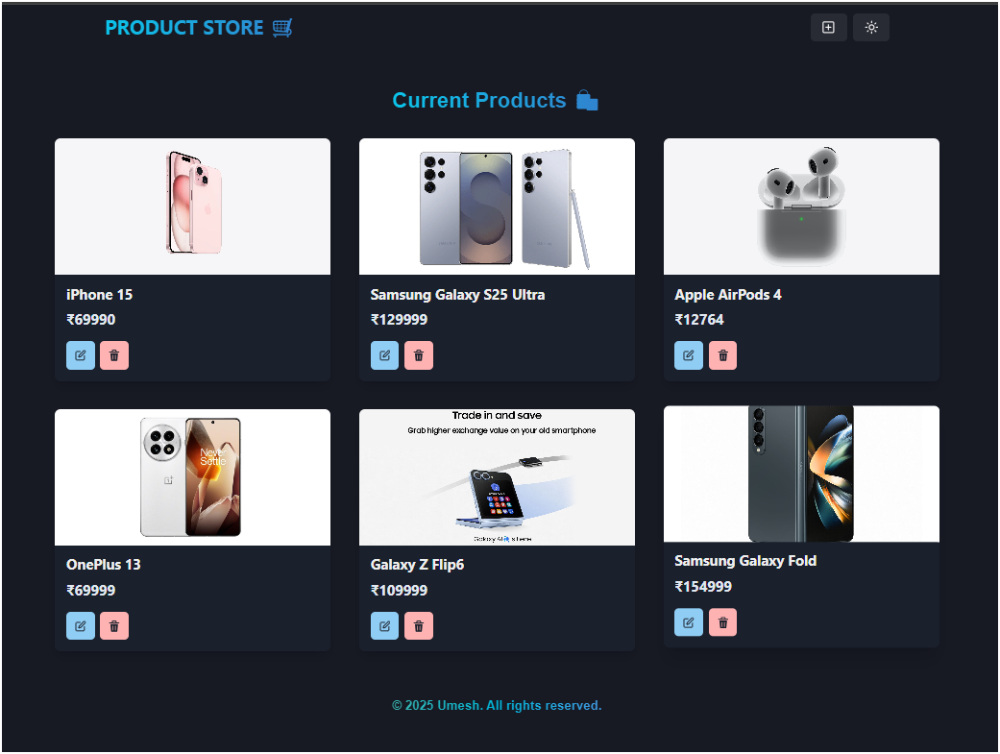
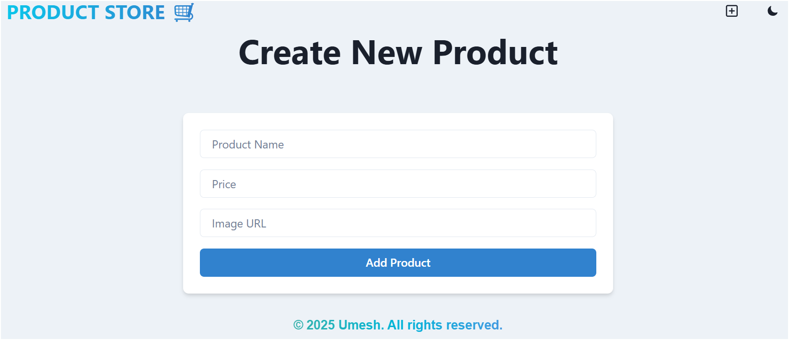
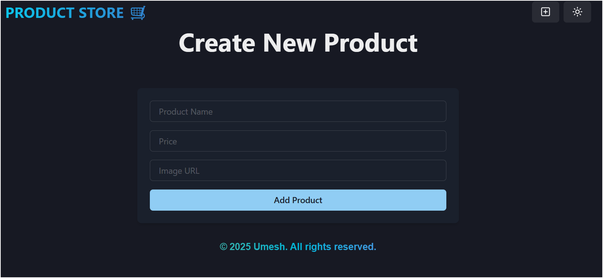

# MERN Crash Course 🚀

## About This Application

This project is built using the **MERN Stack** (MongoDB, Express, React, Node.js) and incorporates **Chakra UI** for building a responsive and modern UI.

### ⚛️ Tech Stack:

-   **Frontend**: React.js, Chakra UI, Zustand (for global state management)
-   **Backend**: Node.js, Express.js
-   **Database**: MongoDB
-   **UI**: Chakra UI for a responsive, user-friendly interface
-   **Error Handling**: Proper error handling mechanisms in place
-   **Deployment**: Deployed for easy access to the live version

### 🔥 Features:

-   **Build an API**: RESTful API with CRUD operations
-   **Responsive UI**: Build with React.js and Chakra UI
-   **Error Handling**: Comprehensive error management in both frontend and backend
-   **Deployment**: Deployed to make the app accessible for users

---

## Setup

1. **Create a `.env` file** in the root directory of the backend and add the following:

    ```bash
    MONGO_URI=your_mongo_uri
    PORT=5000
    ```

2. **Run the app locally**:

    To build the frontend for production:

    ```bash
    npm run build
    ```

    To start the application:

    ```bash
    npm run start
    ```

---

## Global State Management (Frontend)

-   **Zustand**: I have integrated **Zustand** for global state management in the frontend. You can find the store setup in the file:  
    `frontend/src/store/product.js`. This helps in managing all application states efficiently and makes state sharing across components easy.

---

## Demo Screenshots

1. **Home Page**: The homepage features a clean design displaying the current products in a responsive layout.

    

2. **Create New Product Page**: The product creation page is built with light and dark mode, showcasing a smooth user interface experience.

    **Light Mode**:

    

    **Dark Mode**:

    

---

## Deployment

This application is deployed, and you can access it live on the deployed URL. Ensure you have the necessary environment variables set up in the `.env` file for smooth operation.

---

## Conclusion

This app is built to demonstrate the usage of the **MERN stack** with **Zustand** for global state management and **Chakra UI** for a responsive, beautiful interface. The application allows users to view and create products, with an optimized user experience in both light and dark modes.

---

### 💻 Project Adaptation By:

-   **Umesh**
-   **GitHub**: [(https://github.com/umeshsrisatya)]
